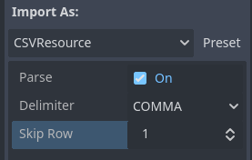

# CSVDataImporter

- A plugin inspired by [godot-csv-typed-importer](https://github.com/citizenll/godot-csv-typed-importer.git)  
- Basically a wrapper for [sep](https://github.com/nietras/Sep.git) csv parser.  
- Import csv table and access the data with C# and GDscript code!
- helper class and extension method to speed up your workflow

## Updates

- Upgrades the project to 4.6
- now support csvdata tsvdata as fileExtension
- add extension method and attribute class to help with data convert

## Important Notes

Godot 4.6 fixed the csv bug and force open csv as text in text editor. The imported resource is not visible currently in editor mode but the run time is not affected.

## Installation

1. Add Sep Package to your .csproj file
2. Build the project and enable the plugin.

```xml
<Project Sdk="Godot.NET.Sdk/4.5.1">
  <PropertyGroup>
 <TargetFramework>net8.0</TargetFramework>
 <EnableDynamicLoading>true</EnableDynamicLoading>
  </PropertyGroup>
  <ItemGroup>
 <PackageReference Include="Sep" Version="0.12.2" />
  </ItemGroup>
</Project>
```

## How to use

### CSV Source



1. Header (1st row) is needed
2. Support Comma or tab Separator, or you can use Auto and leave it the sep to decide.
   1. Check [sep](https://github.com/nietras/Sep.git) to see more detail
3. 2rd row can be set as type indicator.
   1. Current Supported Type: int/float/string/bool/json
   2. json type uses the godot str_to_var native calls
4. Skip row can be set to skip a second header row.

```csv
id,foo
string,string
ID,FOO
1,Hello
2,World
```

### Code Example

#### 1.First create a container for the target object
<!-- The IIndexed interface is for id tracking, but is not really mandatory
Feel free to change the extension method to remove the interface -->
```csharp
using CSVDataImporter;
using Godot;
[GlobalClass]
public partial class Foo : RefCounted, IIndexed
{
    public StringName ID { get; set; }
    [ColumnName("foo")] public string FOO { get; set; }
    public override string ToString()
    {
        return $"ID: {ID}, FOO: {FOO}";
    }
}
```

#### 2.Load it from your c# script with generic method

```csharp
using CSVDataImporter;
using Godot;

public partial class CSharpLoadFirst : Node
{
    public override void _Ready()
    {
    }
    public Foo GetFoo(string id)
    {
        var data = GD.Load<CSVData>("res://scripts/Foo.csv");
        if (data == null)
        {
            GD.PrintErr("Failed to load CSV data.");
            return null;
        }
        var foo = data.ParseRow<Foo>(id);
        return foo;
    }
}
```

#### 3.Call method from gds and retrieve the object

```
func _ready():
 var c = get_node("%CSharpLoader")
 var foo = c.GetFoo("1")
 print("Got foo: %s" % foo)
```

## MIT License

Copyright (c) 2025 Luoshark

Permission is hereby granted, free of charge, to any person obtaining a copy
of this software and associated documentation files (the "Software"), to deal
in the Software without restriction, including without limitation the rights
to use, copy, modify, merge, publish, distribute, sublicense, and/or sell
copies of the Software, and to permit persons to whom the Software is
furnished to do so, subject to the following conditions:

The above copyright notice and this permission notice shall be included in all
copies or substantial portions of the Software.

THE SOFTWARE IS PROVIDED "AS IS", WITHOUT WARRANTY OF ANY KIND, EXPRESS OR
IMPLIED, INCLUDING BUT NOT LIMITED TO THE WARRANTIES OF MERCHANTABILITY,
FITNESS FOR A PARTICULAR PURPOSE AND NONINFRINGEMENT. IN NO EVENT SHALL THE
AUTHORS OR COPYRIGHT HOLDERS BE LIABLE FOR ANY CLAIM, DAMAGES OR OTHER
LIABILITY, WHETHER IN AN ACTION OF CONTRACT, TORT OR OTHERWISE, ARISING FROM,
OUT OF OR IN CONNECTION WITH THE SOFTWARE OR THE USE OR OTHER DEALINGS IN THE
SOFTWARE.
