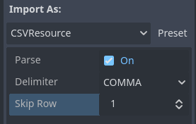

## CSVResource C#
- A plugin inspired by [godot-csv-typed-importer](https://github.com/citizenll/godot-csv-typed-importer.git)  
- Basically a wrapper for [sep](https://github.com/nietras/Sep.git) csv parser.  
- Import csv table and access the data with C# and GDscript code! 

### Installation
1. Add Sep Package to your .csproj file
```
<Project Sdk="Godot.NET.Sdk/4.4.1">
  <PropertyGroup>
    <TargetFramework>net8.0</TargetFramework>
    <EnableDynamicLoading>true</EnableDynamicLoading>
  </PropertyGroup>
  <ItemGroup>
    <PackageReference Include="Sep" Version="0.9.0" />
  </ItemGroup>
</Project>
```
Then build the project and enable the plugin.

### How to use

1. Header (1st row) is needed
2. Support Comma or tab Separator, or you can use Auto and leave it the sep to decide.
   1. Check [sep](https://github.com/nietras/Sep.git) to see more detail
3. 2rd row can be set as type indicator.
   1. Current Supported Type: int/float/string/bool/json
   2. json type uses the godot str_to_var native calls
4. Skip row can be set to skip a second header row.

```
id,name,description,level,percentage,switch,sequence
string,string,string,int,float,bool,json
id,Name,description,Rank,Hit Rate,can_hit,Damage
foo_0,Foo,Test data for csv importer,1,0.1,True,"[1,2,3]"
```

| id     | name   | description                | level | percentage | boolean | sequence |
| ------ | ------ | -------------------------- | ----- | ---------- | ------- | -------- |
| string | string | string                     | int   | float      | bool    | json     |
| Id     | Name   | Description                | Level | Percentage | Boolean | Sequence |
| foo_0  | Foo    | Test data for csv importer | 1     | 0.1        | TRUE    | [1,2,3]  |


### MIT License

Copyright (c) 2025 Luoshark

Permission is hereby granted, free of charge, to any person obtaining a copy
of this software and associated documentation files (the "Software"), to deal
in the Software without restriction, including without limitation the rights
to use, copy, modify, merge, publish, distribute, sublicense, and/or sell
copies of the Software, and to permit persons to whom the Software is
furnished to do so, subject to the following conditions:

The above copyright notice and this permission notice shall be included in all
copies or substantial portions of the Software.

THE SOFTWARE IS PROVIDED "AS IS", WITHOUT WARRANTY OF ANY KIND, EXPRESS OR
IMPLIED, INCLUDING BUT NOT LIMITED TO THE WARRANTIES OF MERCHANTABILITY,
FITNESS FOR A PARTICULAR PURPOSE AND NONINFRINGEMENT. IN NO EVENT SHALL THE
AUTHORS OR COPYRIGHT HOLDERS BE LIABLE FOR ANY CLAIM, DAMAGES OR OTHER
LIABILITY, WHETHER IN AN ACTION OF CONTRACT, TORT OR OTHERWISE, ARISING FROM,
OUT OF OR IN CONNECTION WITH THE SOFTWARE OR THE USE OR OTHER DEALINGS IN THE
SOFTWARE.
